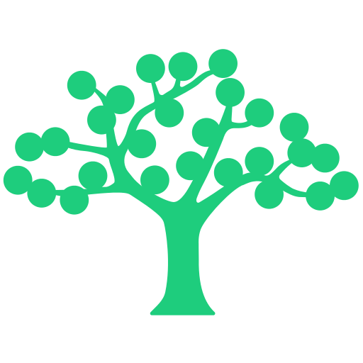

# Go Client for the ReadMe.com API

[](https://github.com/liveoaklabs/readme-api-go-client/releases)
[](https://pkg.go.dev/github.com/liveoaklabs/readme-api-go-client?tab=doc)



A Go client library for the [ReadMe.com](https://readme.com) API.

📖 Refer to <https://pkg.go.dev/github.com/liveoaklabs/readme-api-go-client> for the Go package documentation.

☁️ Also see our [Terraform provider for ReadMe](https://github.com/liveoaklabs/terraform-provider-readme)
that uses this client library.

_This library is developed by [Live Oak Bank](https://liveoakbank.com) and is
not officially associated with ReadMe.com._

## Getting Started

Import the package and call the `readme.NewClient()` function with a token provided to set up the API client.

```go
package main

import "github.com/liveoaklabs/readme-api-go-client/readme"

const readmeAPIKey string = "rdme_xxxxxxxx..."

func main() {
  client, err := readme.NewClient(readmeAPIKey)
  if err != nil {
    log.Fatal(err)
  }
}
```

## Examples

Using the `APISpecification.GetAll()` method to retrieve all API specifications for a project on ReadMe.com:

```go
specs, _, err := client.APISpecifications.GetAll()
if err != nil {
    log.Fatal("Error getting API specifications: ", err)
}

if specs == nil {
    log.Fatal("No results.")
}
```

## Disclaimer About Versioning and Development Status

⚠️ This project is currently under active development and is versioned using
the `0.x.x` scheme. Breaking changes are likely and will result in an
increment to the minor version (e.g., `0.2.0` to `0.3.0).` Users are strongly
advised not to automatically update to new minor or major versions without
thoroughly testing, as the API and functionality may change significantly
between releases.

A stable `1.x` release is planned for the future once the project meets
certain criteria for feature completeness and stability.

## Contributing

Refer to [`CONTRIBUTING.md`](CONTRIBUTING.md) for information on contributing to this project.

## License

This project is licensed under the MIT License - see the [`LICENSE`](LICENSE) file for details.
